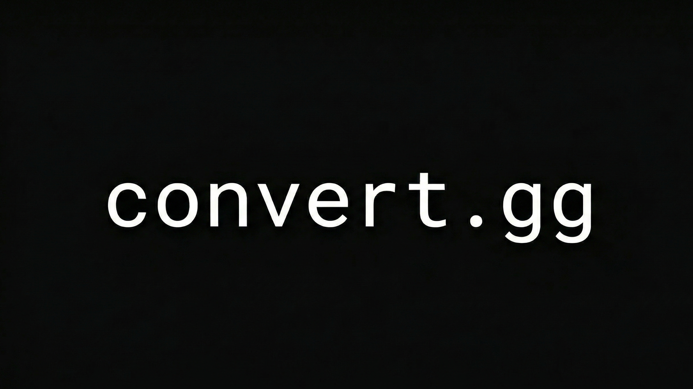

# convert.gg

<div align="center">
  
  <br/>
  <b>The ultimate local media and document conversion tool.</b>
</div>

`convert.gg` is a powerful, privacy-focused desktop application designed to handle your day-to-day file manipulation needs without ever sending your data to the cloud. Whether you're merging PDFs, compressing images, or extracting archives, everything happens securely on your own machine.


## 🚀 Features

### 📄 PDF Tools
*   **Merge & Split**: Combine multiple PDFs or extract specific pages/ranges.
*   **Images to PDF**: Convert collections of images into a single PDF document.
*   **Doc to PDF**: Cross-platform conversion of Word documents (.doc, .docx, .odt) to PDF.
*   **OCR**: Extract text from scanned PDFs using advanced optical character recognition.
*   **Compress & Rotate**: Optimize file size and correct page orientation.

### 🖼️ Media Tools
*   **Universal Conversion**: Convert between major formats (PNG, JPG, WEBP, TIFF, BMP).
*   **Smart Compression**: Intelligently reduce image sizes while maintaining visual quality.

### 📦 Archive Tools
*   **Extraction**: Handle common and complex formats including `.zip`, `.rar`, `.7z`, and `.tar`.
*   **Creation**: Create compressed archives from your files.

---

## 🛠️ Tech Stack

*   **Frontend**: React, Vite, TypeScript, TailwindCSS
*   **Core**: Electron
*   **Backend**: Python (PySidecars)
    *   *Architecture*: Heavy lifting is delegated to specialized Python scripts.
    *   *Production*: Scripts are compiled into standalone binaries using **PyInstaller**, ensuring converting power without requiring the end-user to install Python.

---

## 💻 Development

### Prerequisites
*   **Node.js** (v18 or higher)
*   **Python** (v3.10 or higher) - *Required for working with sidecars*

### 1. Installation

Clone the repository and install Node dependencies:

```bash
git clone https://github.com/ikenai-lab/convertor.git
cd convertor
npm install
```

### 2. Python Setup (Important)

To run the app in `development` mode, you need a local Python environment with the required packages.

```bash
# Create a virtual environment
python -m venv py-sidecars/venv

# Activate it
# Windows:
py-sidecars\venv\Scripts\activate
# Linux/macOS:
source py-sidecars/venv/bin/activate

# Install dependencies
pip install -r py-sidecars/requirements.txt
```

### 3. Running Locally

Start the Vite dev server and Electron process:

```bash
npm run electron:dev
```

*Note: In development mode, the app uses your local `venv` python executable to run the scripts in `py-sidecars/`.*

### 4. Building for Production

To create an installer (DMG, Setup.exe, AppImage, Zip, Tar.gz):

```bash
npm run build
```

**What happens during build?**
1.  **Compile Python**: `scripts/compile-python.js` runs PyInstaller to compile all python tools into standalone binaries in `dist-python/`.
2.  **Compile Frontend**: Vite builds the React app.
3.  **Compile Backend**: TypeScript compiles the Electron main process.
4.  **Package**: Electron Builder bundles everything (including the verified binaries) into a final executable, ensuring `venv` bloat is excluded.

---

## 📄 License

This project is licensed under the MIT License - see the [LICENSE](LICENSE) file for details.
